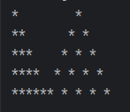
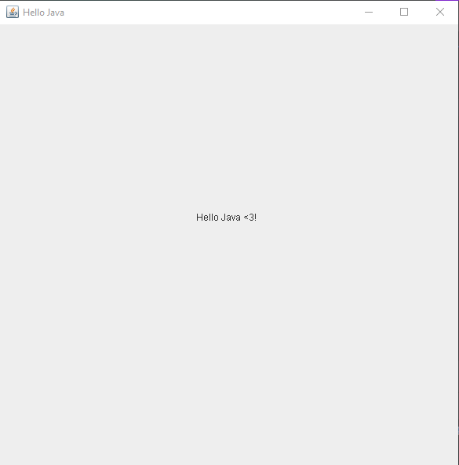

# Lab 3
I created a non-GUI Application that accepts a well formed IP Address in the form of a string and cuts it into separate parts based on the dot delimiter.The program, for example, should be run 163.121.12.30

• The output should then be:

  163

  121

  12

  30

I used three ways: 
1. split    
2. StringTokenizer   
3. substring & indexOf

Second, I created a simple non-GUI Application that carries out the functionality of a basic calculator (addition, subtraction, multiplication, and division).

Also, It was a problem solving example to print this shape to practice on nested loops.

Finally, I created a simple GUI Application that shows Hello Java.
