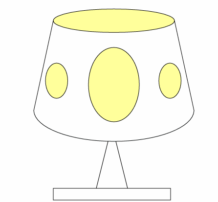

# Lab 4
In this lab, I created an GUI program that displays the list of available fonts in the underlying platform. Each font should be written in its own font. I make twice one using Toolkit and the another using Graphics Environment.

Then, I created an GUI program that makes use of the Graphics class drawing methods.
I drew the following lamp:
