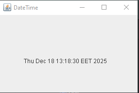
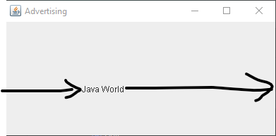
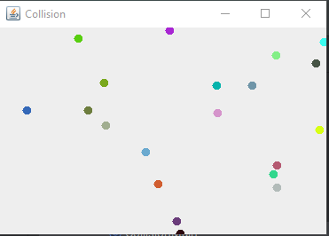

# Lab 5
I created a GUI application that displays the date and time on it using threads.

I create a GUI application that displays a marquee string on it.

I create a GUI application that displays a ball which moves randomly, and when it reaches the boundaries, it changes its direction.

Modifying the ball example I made when two balls collide a new ball will appear with an infinite number of balls.

