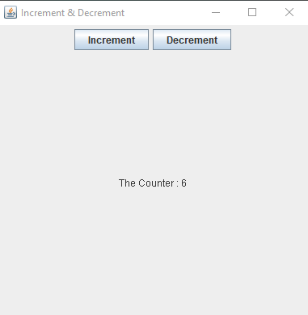
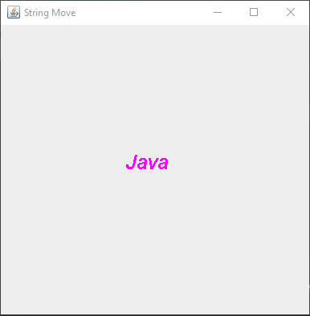
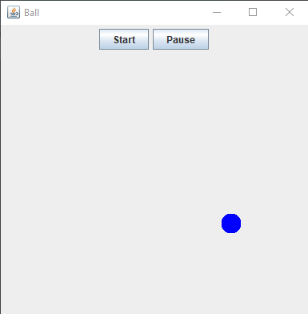
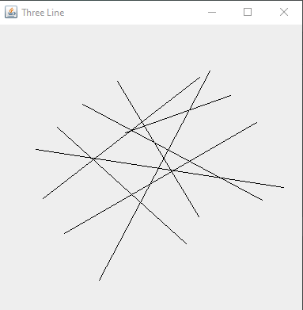

# Lab 6
This lab contains several applications.

-I created a GUI application that has two buttons, one to increment the counter value and one to decrement this value.

-I created a GUI application that displays a string that the user can move using arrow keys.

-Created a GUI application that has two buttons, one to let the ball start moving randomly and one to pause the ball's movement.

-Created a GUI application that draws an oval that the user can drag around the JPanel.

-Created a GUI application that allows the user to draw one line by dragging the mouse on the JPanel.

-Modifying the previous exercise to allow the user to draw only three lines on the GUI application. Store the drawn lines in an array to be able to redraw them again when the app is repainted.

-In the previous exercise, the user can only draw a certain number of lines because of the fixed array size.Modifying the previous exercise by storing the lines in an ArrayList to allow an unlimited number.

